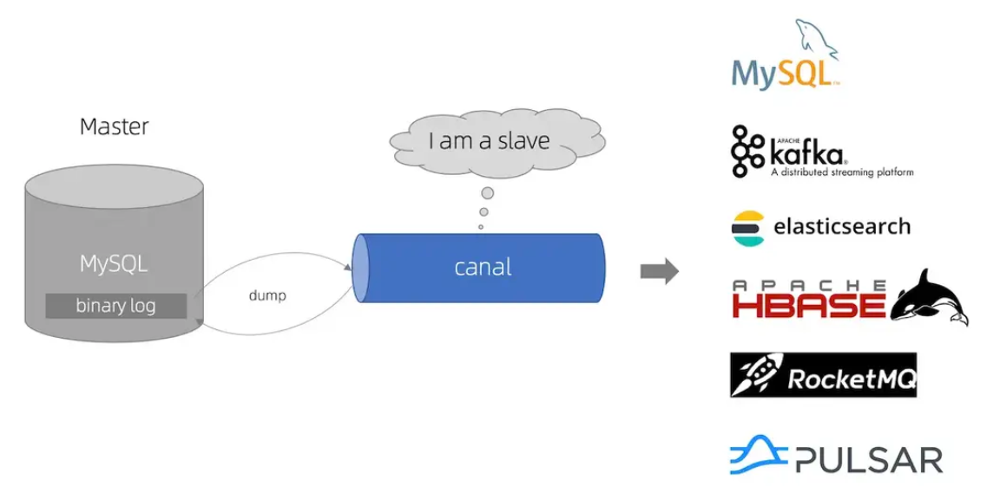
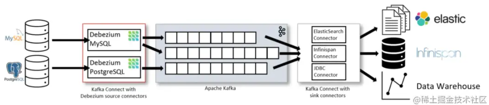
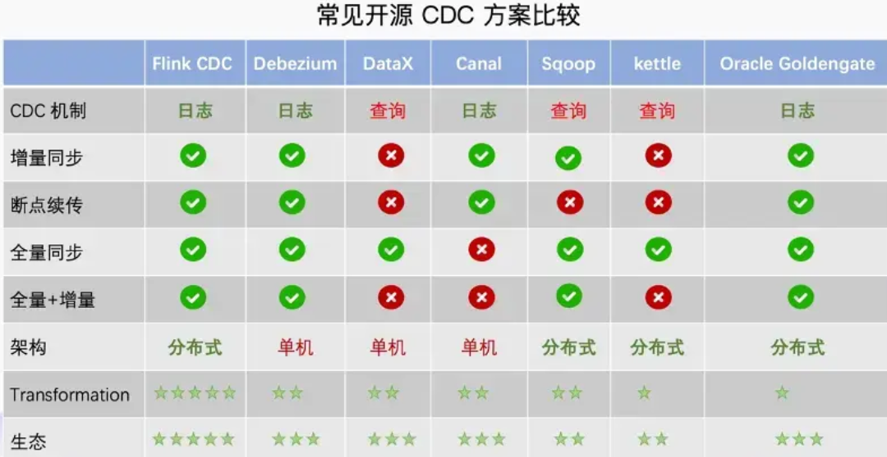

# CDC技术复盘：从"人工搬运"到"实时流转"

---

## TL;DR

- CDC捕获DB变更日志(binlog/WAL/Redo Log)，非轮询
- 三代演进：查询触发 → 日志解耦(Canal/Debezium) → 流批一体(Flink CDC)
- □ Canal：MySQL专属，轻量快速
- □ Debezium：多DB支持，三种部署模式(Kafka Connect/Server/Embedded)
- □ Flink CDC：同步即计算，Exactly-Once原生支持
- § 小团队解耦：CDC可直接替代MQ，无需Kafka

---

## 一、CDC是什么

**定义**：CDC(Change Data Capture)捕获DB的Insert/Update/Delete变更。

**核心机制**：
```
DB写入 → binlog/WAL/Redo Log → CDC工具 → 事件流
```

● 只捕获已提交变更，无需担心事务回滚
● 基于DB原生复制机制，非侵入式

---

## 二、三代技术演进

### ▷ 第一代：查询触发

**原理**：轮询SQL查询变更
```sql
SELECT * FROM table WHERE update_time > last_sync_time
```

○ 无法捕获DELETE
○ 需修改表结构(加时间戳字段)
○ 实时性差(秒级)

---

### ▷ 第二代：日志解耦

#### Canal — MySQL"死忠粉"

**原理**：伪装MySQL Slave，接收binlog
```
MySQL Master → binlog → Canal → 消息队列
```

● 性能极高，毫秒级延迟
● 无侵入，不改表结构
○ 仅支持MySQL/MariaDB

#### Debezium — "全能王"

**原理**：Kafka Connect Source Connector，读日志写Kafka
```
DB → binlog/WAL → Debezium → Kafka Topic → 消费者
```


**为何需要Kafka中转？**

无Kafka时：
```
DB → Debezium → 服务A
              → 服务B
              → 服务C
```
问题：Debezium维护10个连接，DB压力倍增。

有Kafka时：
```
DB → Debezium → Kafka Topic ← 服务A
                              ← 服务B
                              ← 服务C
```
● 解耦生产消费
● 削峰填谷
● 数据可回溯

**三种部署模式**：

| 模式 | 特点 | 场景 |
|-----|------|------|
| Kafka Connect | 高可用、分布式 | 企业级生产 |
| Debezium Server | 独立应用，支持Kinesis/PubSub/Pulsar/HTTP | 无Kafka环境 |
| Embedded | 库嵌入Java应用 | 微服务、轻量级 |

**Debezium Server独立模式**：

 misconception：Debezium必须依赖Kafka。

 reality：Debezium Server可直接发送到多种Sink：
```
DB → Debezium Server → Kinesis/PubSub/Pulsar/RabbitMQ/HTTP
```

配置示例：
```yaml
debezium:
  source:
    connector.class: io.debezium.connector.mysql.MySqlConnector
    database.hostname: localhost
    table.include.list: inventory.orders
  sink:
    type: http
    http.url: http://order-service:8080/events
```

**Embedded模式**：

信奉"如非必要，勿增实体"？Embedded是最轻量选择。

```java
@Bean
public DebeziumEngine<ChangeEvent<String, String>> debeziumEngine() {
    Properties props = new Properties();
    props.setProperty("connector.class", "io.debezium.connector.mysql.MySqlConnector");
    props.setProperty("table.include.list", "inventory.orders");
    // props.setProperty配置db连接（略）
    
    return DebeziumEngine.create(Json.class)
        .using(props)
        .notifying(record -> processEvent(record))
        .build();
}
```

● 无需部署Kafka
● 低延迟，资源占用少
○ 无高可用，无数据堆积能力

---

### ▷ 第三代：流批一体(Flink CDC)

**原理**：CDC集成在计算引擎，DB即"流"。

**核心特性**：
1. 全量+增量自动处理(快照→binlog无缝切换)
2. ETL一体化(同步即Join/聚合/清洗)
3. Exactly-Once语义(基于Checkpoint)

```
传统：MySQL → Canal/Debezium → Kafka → Flink → 目标存储
Flink CDC：MySQL → Flink CDC → 目标存储
```

● 极简架构，无Kafka中转
● 流批一体
○ 需Flink知识

---

## 三、全方位对比

| 维度 | Canal | Debezium | Flink CDC |
|-----|-------|----------|-----------|
| 数据源 | MySQL/MariaDB | 极广(MySQL,PG,Oracle,SQLServer,MongoDB,DB2) | 极广(MySQL,PG,TiDB,Oracle,SQLServer,MongoDB) |
| 架构 | Server+Client | Kafka Connect/Server/Embedded | Flink Job(可无Kafka) |
| 全量同步 | ○需配合DataX | ●自动支持 | ●完美支持 |
| Exactly-Once | ○需自行实现 | ⚠️需Kafka事务 | ●原生支持 |
| 数据加工 | ○无 | ○无 | ●强(Join/聚合/清洗) |
| 部署复杂度 | 低 | 高 | 中 |


---

## 四、数据一致性语义

| 语义 | 含义 | 场景 | 复杂度 |
|-----|------|------|--------|
| At-Most-Once | 可能丢失，不重复 | 日志、监控 | 低 |
| At-Least-Once | 不丢失，可能重复 | 大多数业务 | 中 |
| Exactly-Once | 不丢失，不重复 | 金融交易 | 高 |

**工程建议**：At-Least-Once + 消费者幂等，是最优解。

幂等实现：
```java
public void consume(OrderEvent event) {
    String key = event.getOrderId() + "_" + event.getEventType();
    if (redis.setnx(key, "1", Duration.ofHours(24))) {
        processOrder(event); // 首次执行
    }
}
```

---

## 五、选型金字塔

### 决策流程

```
                    开始选型
                       │
        ┌──────────────┴──────────────┐
        │                             │
   只有MySQL/MariaDB              多种数据库
        │                             │
   需复杂实时计算?               需复杂实时计算?
    是/    \否                   是/    \否
     /        \                  /        \
Flink CDC   Canal          Flink CDC   Debezium
```

### 场景化建议

**§ 场景一：只有MySQL，追求简单**
→ **Canal**
● 阿里出品，中文文档丰富
● 架构简单，部署成本低

**§ 场景二：多数据源，已有Kafka**
→ **Debezium(Kafka Connect)**
● 多DB支持，统一技术栈
● 与Kafka生态无缝集成

**§ 场景二(变体)：多数据源，不想引入Kafka**
→ **Debezium Server(独立模式)**
● 支持Kinesis/PubSub/Pulsar/RabbitMQ/HTTP
● 单个容器即可运行

**§ 场景三：需复杂实时处理**
→ **Flink CDC**
● 同步即计算
● Exactly-Once原生支持

**§ 场景四：小团队，不想维护MQ，需业务解耦**
→ **Debezium Embedded** 或 **Canal**

架构：
```
订单服务(只写DB) → MySQL → CDC → 库存/通知服务
```

● 零侵入，订单服务代码不改
● 无中间件，CDC直连消费者
● 渐进式演进，后期可平滑迁移到Kafka

**何时升级到Kafka？**

| 信号 | 说明 |
|-----|------|
| 消费者>5个 | Embedded单点消费成瓶颈 |
| 消费延迟>1分钟 | 需Kafka堆积能力 |
| 需数据回溯 | 新服务消费历史数据 |
| 多语言消费 | 需标准协议 |

升级路径：
```
阶段1：MySQL → Debezium(Embedded) → 消费者
阶段2：MySQL → Debezium → Kafka → 多个消费者
```

对订单服务**完全透明**，依然只写DB。

---

## 六、工程实践

### 实践一：Redis与MySQL双写一致性

**传统问题**：
```java
userRepository.save(user);      // 写DB
cache.delete("user:" + id);     // 删缓存
// 问题：DB成功，Redis失败，数据不一致
```

**CDC方案**：
```
应用只写MySQL → Debezium Server(HTTP模式) → 调用缓存服务API → 删Redis
```

● 单向数据流
● 最终一致性
● 应用代码极简

### 实践二：CQRS架构数据同步

```
写侧(Command) → DB → CDC → MQ → 读侧(Query)更新
```

● 读写完全解耦
● 读侧自动更新
● 天然支持事件溯源

### 实践三：轻量级业务解耦(无MQ)

**场景**：订单创建后异步处理库存扣减和通知，不想维护Kafka。

**传统困境**：
```java
orderService.createOrder(order);
inventoryService.deductStock(order);  // 同步调用，强耦合
notificationService.sendSms(order);   // 阻塞主流程
```

**CDC方案**：

1. 订单服务只写DB：
```java
orderService.createOrder(order);  // 写完即返回
```

2. CDC监听orders表变更

3. 轻量消费者处理：
```java
@Component
public class OrderEventHandler {
    @EventListener
    public void onOrderCreated(OrderCreatedEvent event) {
        inventoryService.deductStock(event.getOrder());
        notificationService.sendSms(event.getOrder());
    }
}
```

**数据一致性**：

轻量级方案提供At-Least-Once语义：
● 数据不丢失(基于DB事务)
○ 可能重复投递

幂等消费：
```java
@EventListener
public void onOrderCreated(OrderCreatedEvent event) {
    String key = String.format("order:%s:%s", event.getOrderId(), event.getEventType());
    if (redis.opsForValue().setIfAbsent(key, "1", Duration.ofHours(24))) {
        inventoryService.deductStock(event.getOrder());
        notificationService.sendSms(event.getOrder());
    }
}
```

---

## 七、结语

CDC本质是平衡**实时性**、**一致性**与**系统复杂性**。

- 只有MySQL，追求简单 → **Canal**
- 多数据源，依赖Kafka → **Debezium(Kafka Connect)**
- 多数据源，不想引入Kafka → **Debezium Server(独立模式)**
- 同步即计算，架构极简 → **Flink CDC**
- 小团队，不想维护MQ，需业务解耦 → **Debezium Embedded** 或 **Canal**

### 选型原则

1. 不要为了技术而技术
2. 考虑团队能力
3. 着眼未来，避免后期重构
4. 从简单开始，渐进式演进
5. CDC可作为MQ"前置方案"，避免过度设计

---

**CDC不是什么新技术，只是把DB本来就在做的事情(记录变更日志)，用更优雅的方式暴露出来。**

理解CDC的本质，比学会使用某个工具更重要。
